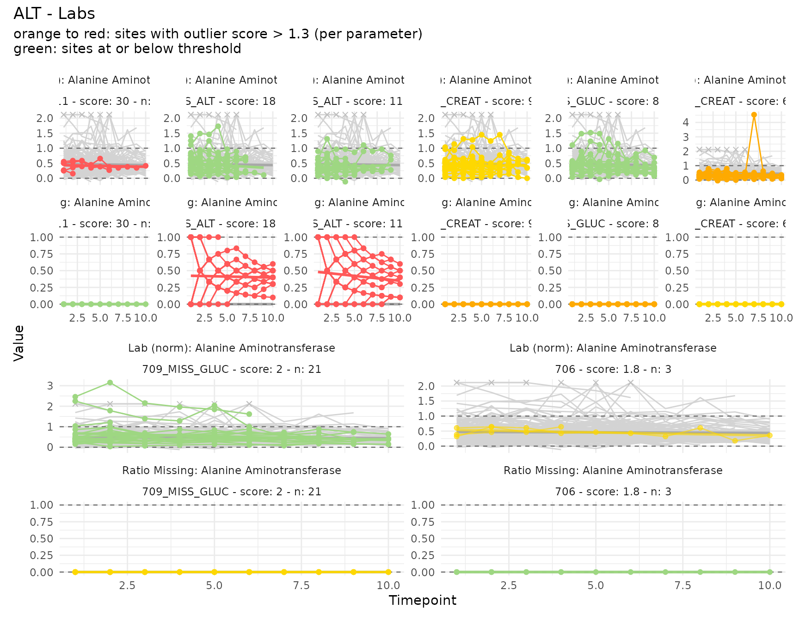
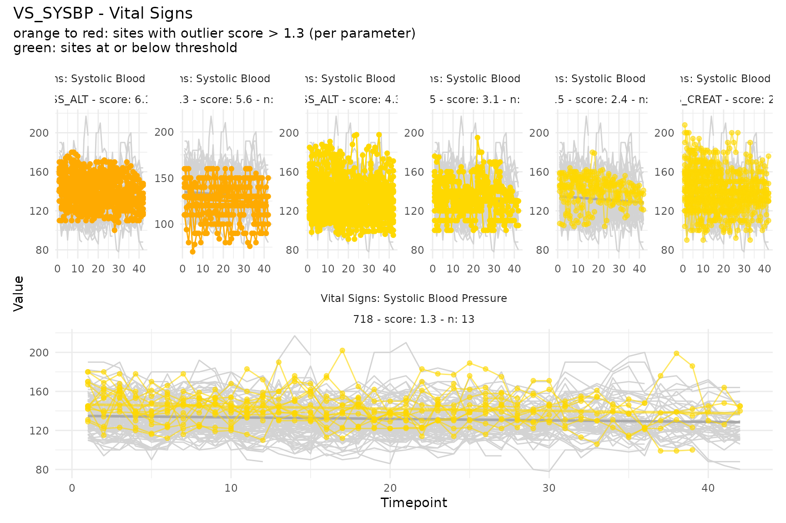
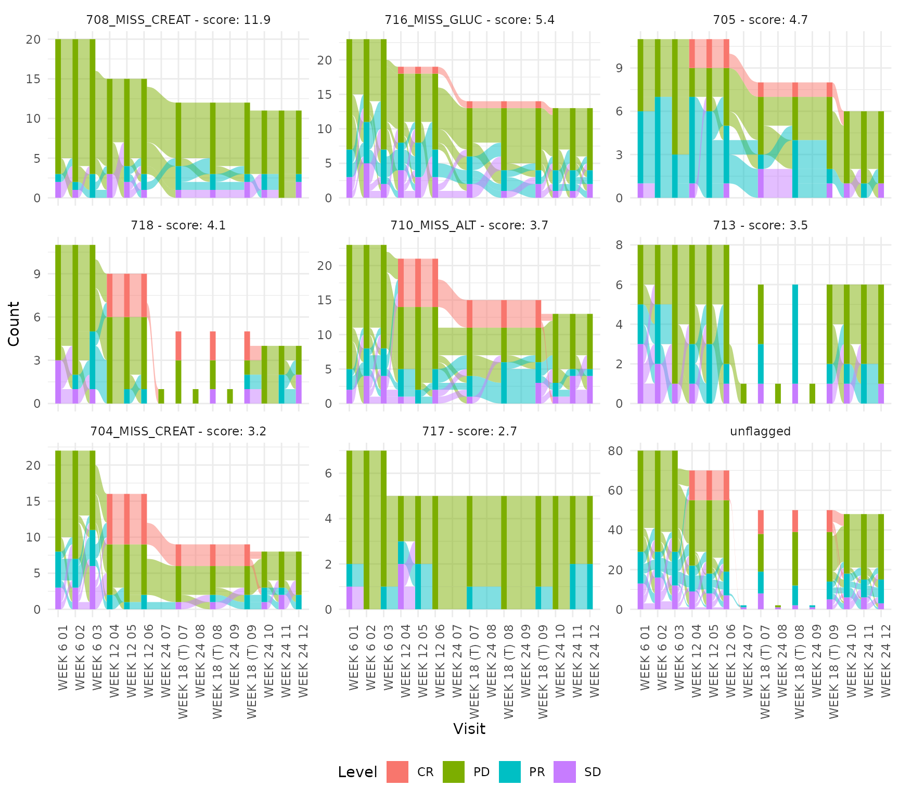
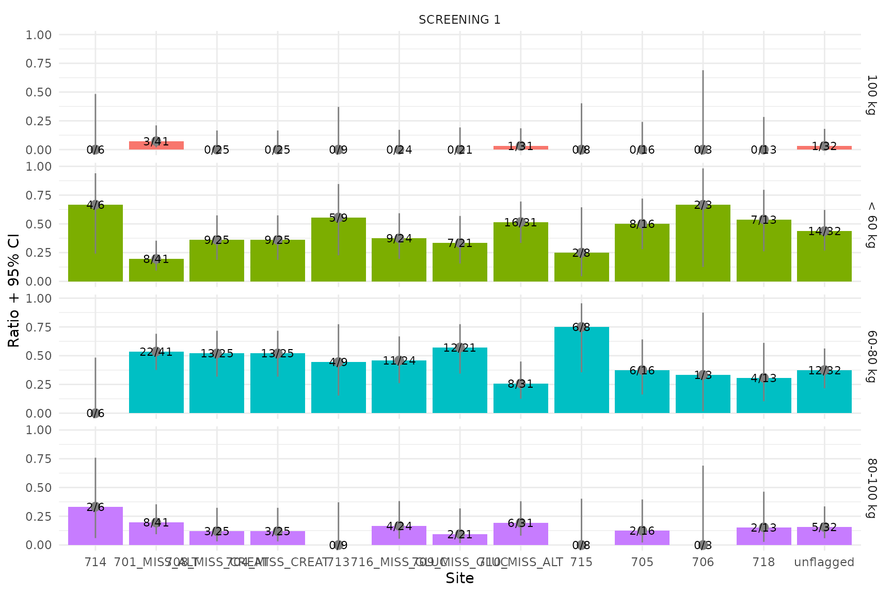

# User Guide

## Overview

`ctasapp` is a Shiny application for exploring results from the
[ctas](https://github.com/IMPALA-Consortium/ctas) (Clinical Timeseries
Anomaly Spotter) R package. The data pipeline is:

    Raw SDTM domains (dm, lb, vs, rs_onco)
      |
      v
    Input_*() helpers               -- transform to ctas input + keep untransformed originals
      |
      v
    ctas::process_a_study()         -- compute site-level outlier scores
      |
      v
    ctasapp (Shiny visualization)   -- interactive exploration of scores, plots, and data

Each `Input_*()` helper returns a list with four elements:

| Element         | Description                                                                     |
|:----------------|:--------------------------------------------------------------------------------|
| `data`          | Transformed timeseries in ctas format (one row per subject/timepoint/parameter) |
| `subjects`      | Subject metadata (`subject_id`, `site`, `country`, `region`)                    |
| `parameters`    | Parameter metadata with plot-type classification                                |
| `untransformed` | Pre-transformation values with reference ranges for display                     |

## Input data structure

The **`data`** element has the following columns:

| Column             | Type      | Description                                           |
|:-------------------|:----------|:------------------------------------------------------|
| `subject_id`       | character | Subject identifier (USUBJID)                          |
| `parameter_id`     | character | Unique parameter key (e.g. `LB_NORM_ALT`, `VS_SYSBP`) |
| `timepoint_rank`   | integer   | Positional visit index (1, 2, 3, …)                   |
| `timepoint_1_name` | character | Visit label (e.g. “WEEK 2”, “SCREENING 1”)            |
| `timepoint_2_name` | character | Secondary timepoint (usually NA)                      |
| `baseline`         | logical   | Baseline flag (usually NA)                            |
| `result`           | numeric   | Transformed value for ctas                            |

The **`parameters`** element defines each parameter:

| Column                 | Type      | Description                                       |
|:-----------------------|:----------|:--------------------------------------------------|
| `parameter_id`         | character | Matches `data$parameter_id`                       |
| `parameter_name`       | character | Human-readable label                              |
| `parameter_category_1` | character | Broad domain (e.g. “Labs”, “Vital Signs”)         |
| `parameter_category_2` | character | Field-level grouping key (e.g. “ALT”, “VS_SYSBP”) |
| `parameter_category_3` | character | Plot type: see table below                        |

The `parameter_category_3` value determines how the parameter is
visualized:

| `parameter_category_3` | Plot type                                        | Produced by                                                                                                                      |
|:-----------------------|:-------------------------------------------------|:---------------------------------------------------------------------------------------------------------------------------------|
| `range_normalized`     | Faceted line plot (values in 0–1 range)          | `Input_Labs` via [`normalize_by_range()`](https://IMPALA-Consortium.github.io/ctasapp/reference/normalize_by_range.md)           |
| `ratio_missing`        | Faceted line plot (paired with range_normalized) | `Input_Labs` via [`ratio_missing_over_time()`](https://IMPALA-Consortium.github.io/ctasapp/reference/ratio_missing_over_time.md) |
| `numeric`              | Line plot (raw values)                           | `Input_VS`                                                                                                                       |
| `categorical`          | Alluvial / stacked bar plot                      | `Input_RS` via [`encode_categorical()`](https://IMPALA-Consortium.github.io/ctasapp/reference/encode_categorical.md)             |
| `bar`                  | Single-timepoint bar chart                       | `Input_BMI` via [`encode_categorical()`](https://IMPALA-Consortium.github.io/ctasapp/reference/encode_categorical.md)            |

### Example: `Input_Labs` structure

``` r
library(pharmaversesdtm)
data("dm"); data("lb")

labs <- ctasapp::Input_Labs(dm, lb)
str(labs, max.level = 1)
```

    List of 5
     $ data          : tibble [82,918 x 7]
     $ subjects      : tibble [254 x 4]
     $ parameters    : tibble [78 x 5]
     $ untransformed : tibble [46,164 x 6]

``` r
head(labs$data[labs$data$parameter_id == "LB_NORM_ALT", ])
```

      subject_id parameter_id timepoint_rank timepoint_1_name timepoint_2_name baseline    result
      AB12345-01 LB_NORM_ALT              1       SCREENING 1             NA       NA  0.6363636
      AB12345-01 LB_NORM_ALT              2            WEEK 2             NA       NA  0.5454545
      ...

``` r
head(labs$parameters)
```

      parameter_id      parameter_name parameter_category_1 parameter_category_2 parameter_category_3
      LB_NORM_ALT   ALT (norm)         Labs                 ALT                  range_normalized
      LB_MISS_ALT   ALT (missing)      Labs                 ALT                  ratio_missing
      LB_NORM_ALKPH ALKPH (norm)        Labs                 ALKPH                range_normalized
      LB_MISS_ALKPH ALKPH (missing)     Labs                 ALKPH                ratio_missing
      ...

## Data transformations

### Range normalization

[`normalize_by_range()`](https://IMPALA-Consortium.github.io/ctasapp/reference/normalize_by_range.md)
transforms lab values into a 0–1 scale using reference ranges. Values
within the normal range fall between 0 and 1; below-range values are
negative, above-range are greater than 1.

$$\text{result} = \frac{\text{value} - \text{lower}}{\text{upper} - \text{lower}}$$

``` r
value <- c(15, 30, 45, 60)
lower <- rep(10, 4)
upper <- rep(50, 4)

normalize_by_range(value, lower, upper)
#> [1] 0.125 0.500 0.875 1.250
```

[`Input_Labs()`](https://IMPALA-Consortium.github.io/ctasapp/reference/Input_Labs.md)
applies this to each lab parameter, producing rows with
`parameter_id = "LB_NORM_<LBTESTCD>"` and
`parameter_category_3 = "range_normalized"`.

### Ratio of missing values

[`ratio_missing_over_time()`](https://IMPALA-Consortium.github.io/ctasapp/reference/ratio_missing_over_time.md)
computes a running proportion of missing (NA) values per subject and
parameter. At timepoint $k$, the value is:

$$\text{ratio}_{k} = \frac{\sum\limits_{i = 1}^{k}\mathbf{1}\left\lbrack \text{value}_{i} = \text{NA} \right\rbrack}{k}$$

A subject with no missing values always has ratio 0. One with all values
missing has ratio 1.

``` r
value <- c(10, NA, 30, NA, 50)
subject_id <- rep("subj_1", 5)
parameter_id <- rep("ALT", 5)

ratio_missing_over_time(value, subject_id, parameter_id)
#> [1] 0.0000000 0.5000000 0.3333333 0.5000000 0.4000000
```

[`Input_Labs()`](https://IMPALA-Consortium.github.io/ctasapp/reference/Input_Labs.md)
produces these rows with `parameter_id = "LB_MISS_<LBTESTCD>"` and
`parameter_category_3 = "ratio_missing"`. The missingness parameter
shares the same `parameter_category_2` as its range-normalized sibling
(e.g. both `LB_NORM_ALT` and `LB_MISS_ALT` have
`parameter_category_2 = "ALT"`). In the app, these are displayed as a
faceted pair: the upper facet shows the normalized values, the lower
shows the missingness ratio.

### Categorical encoding

[`encode_categorical()`](https://IMPALA-Consortium.github.io/ctasapp/reference/encode_categorical.md)
one-hot encodes a categorical variable into a long format. Each
observation is expanded into one row per category level, with
`encoded = 1` where the observation matches the level and `encoded = 0`
otherwise.

``` r
responses <- c("CR", "PR", "SD", "PD", "CR", "SD")
encoded <- encode_categorical(responses, prefix = "RS_OVRLRESP")
head(encoded, 10)
#>    orig_row          level encoded
#> 1         1 RS_OVRLRESP=CR       1
#> 2         2 RS_OVRLRESP=CR       0
#> 3         3 RS_OVRLRESP=CR       0
#> 4         4 RS_OVRLRESP=CR       0
#> 5         5 RS_OVRLRESP=CR       1
#> 6         6 RS_OVRLRESP=CR       0
#> 7         1 RS_OVRLRESP=PD       0
#> 8         2 RS_OVRLRESP=PD       0
#> 9         3 RS_OVRLRESP=PD       0
#> 10        4 RS_OVRLRESP=PD       1
```

[`Input_RS()`](https://IMPALA-Consortium.github.io/ctasapp/reference/Input_RS.md)
uses this to transform `RSORRES` values. The resulting `parameter_id`
values are `"RS_OVRLRESP=CR"`, `"RS_OVRLRESP=PD"`, etc., and
`parameter_category_3 = "categorical"`. The app renders these as
alluvial plots showing how response categories flow across visits.

### Bar (single-timepoint categorical)

[`Input_BMI()`](https://IMPALA-Consortium.github.io/ctasapp/reference/Input_BMI.md)
creates a screening-only weight category from vital signs. Weights are
binned into categories (`< 60 kg`, `60-80 kg`, `80-100 kg`,
`>= 100 kg`), then one-hot encoded like `Input_RS`. With only a single
timepoint per subject, `parameter_category_3 = "bar"` signals that the
app should render a bar chart rather than an alluvial plot.

``` r
library(pharmaversesdtm)
data("dm"); data("vs")

bmi <- ctasapp::Input_BMI(dm, vs)
head(bmi$parameters)
```

      parameter_id                parameter_name parameter_category_1 parameter_category_2 parameter_category_3
      VS_WEIGHT_CAT=60-80 kg     60-80 kg       Vital Signs          VS_WEIGHT_CAT        bar
      VS_WEIGHT_CAT=80-100 kg    80-100 kg      Vital Signs          VS_WEIGHT_CAT        bar
      VS_WEIGHT_CAT=>= 100 kg    >= 100 kg      Vital Signs          VS_WEIGHT_CAT        bar
      VS_WEIGHT_CAT=< 60 kg      < 60 kg        Vital Signs          VS_WEIGHT_CAT        bar

### Plain numeric

[`Input_VS()`](https://IMPALA-Consortium.github.io/ctasapp/reference/Input_VS.md)
passes vital-sign measurements through without transformation. The raw
`VSSTRESN` values become `result`, and
`parameter_category_3 = "numeric"`. These are rendered as simple line
plots in the app.

``` r
library(pharmaversesdtm)
data("dm"); data("vs")

vs_input <- ctasapp::Input_VS(dm, vs)
head(vs_input$data[vs_input$data$parameter_id == "VS_SYSBP", ])
```

      subject_id parameter_id timepoint_rank timepoint_1_name result
      AB12345-01 VS_SYSBP              1       SCREENING 1      132
      AB12345-01 VS_SYSBP              2       BASELINE          128
      AB12345-01 VS_SYSBP              3       WEEK 2            130
      ...

## Example plots

The package bundles pre-computed sample data (`sample_sdtm_data` and
`sample_sdtm_results`) derived from `pharmaversesdtm`. These can be used
directly to generate all plot types.

``` r
m <- prepare_measures(sample_sdtm_data, sample_sdtm_results)
```

### Range-normalized lab values with missingness ratio

The `ALT` parameter has both `LB_NORM_ALT` (range-normalized) and
`LB_MISS_ALT` (missingness ratio). They are plotted together as a
faceted pair.

``` r
plot_timeseries(c("LB_NORM_ALT", "LB_MISS_ALT"), m, thresh = 1.3)
```



### Plain numeric vital signs

Systolic blood pressure (`VS_SYSBP`) uses raw numeric values without
normalization.

``` r
plot_timeseries("VS_SYSBP", m, thresh = 1.3)
```



### Categorical (alluvial)

Overall response (`RS_OVRLRESP`) categories are displayed as an alluvial
plot showing transitions across visits.

``` r
cat_ids <- unique(m$parameter_id[grepl("^RS_OVRLRESP=", m$parameter_id)])
plot_categorical(cat_ids, m, thresh = 1.3)
```



### Bar (single-timepoint)

Screening weight categories are displayed as a bar chart since there is
only one timepoint per subject.

``` r
bar_ids <- unique(m$parameter_id[grepl("^VS_WEIGHT_CAT=", m$parameter_id)])
plot_bar(bar_ids, m, thresh = 1.3)
#> Warning: There were 32 warnings in `dplyr::mutate()`.
#> The first warning was:
#> ℹ In argument: `ci95_low = purrr::map2_dbl(...)`.
#> Caused by warning in `stats::prop.test()`:
#> ! Chi-squared approximation may be incorrect
#> ℹ Run `dplyr::last_dplyr_warnings()` to see the 31 remaining warnings.
```



## Uploading your own data

The app supports uploading custom data via 2 mandatory and 2 optional
flat files (CSV, Parquet, or RDA):

| File          | Required | Description                                                                                                                 |
|:--------------|:---------|:----------------------------------------------------------------------------------------------------------------------------|
| Results       | Yes      | Pre-joined `site_scores` + `timeseries` from [`ctas::process_a_study()`](https://rdrr.io/pkg/ctas/man/process_a_study.html) |
| Input         | Yes      | Pre-joined `data` + `subjects` + `parameters` (one row per observation)                                                     |
| Untransformed | No       | Original values before transformation (for display in data tables)                                                          |
| Queries       | No       | Clinical query records (overlaid as dots on plots)                                                                          |

See the collapsible “File format documentation” panel in the app’s Data
tab for full column specifications. An optional `study` column in the
Input file enables multi-study filtering in the Fields panel.

### Generating example upload files

Use
[`generate_sample_csv()`](https://IMPALA-Consortium.github.io/ctasapp/reference/generate_sample_csv.md)
to create a set of example CSV files from the bundled sample data. This
is useful for trying the upload feature or as a template for your own
data:

``` r
generate_sample_csv("~/my_upload_files")
```

This writes `results.csv`, `input.csv`, `untransformed.csv`, and
`queries.csv` into the specified directory. The files combine both
sample datasets (`sample_ctas_data` as STUDY-001 and `sample_sdtm_data`
as STUDY-002) into a multi-study upload example.
